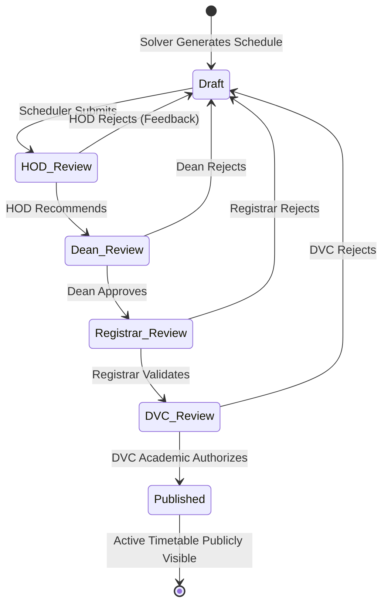

# University Timetable System - Complete Documentation

## Table of Contents
1. [System Overview](#system-overview)
2. [Architecture](#architecture)
3. [Database Models](#database-models)
4. [Key Features](#key-features)
5. [Technologies & Dependencies](#technologies--dependencies)
6. [Configuration](#configuration)
7. [API Endpoints](#api-endpoints)
8. [URL Routes](#url-routes)
9. [Core Components](#core-components)
10. [Scheduling Engine](#scheduling-engine)
11. [Conflict Detection](#conflict-detection)
12. [Calendar Integration](#calendar-integration)
13. [Authentication & Authorization](#authentication--authorization)
14. [Import/Export Functionality](#importexport-functionality)
15. [Running the System](#running-the-system)
16. [Development Setup](#development-setup)
17. [Enterprise Modules Blueprint](#enterprise-modules-blueprint)

---

## System Overview

This is a **Multi-University Timetable Management System** built with Django that automates the complex process of creating academic schedules. The system uses constraint satisfaction programming (Google OR-Tools) to generate optimal timetables while respecting various hard and soft constraints.

### Key Capabilities
- **Automated Scheduling**: Uses CP-SAT solver to generate conflict-free timetables
- **Multi-University Support**: Manages multiple universities, campuses, faculties, and departments
- **Role-Based Access**: Admin, Scheduler, Lecturer, and Student roles
- **Real-time Updates**: Firebase integration for live status updates
- **Calendar Integration**: Google Calendar sync for lecturers
- **Conflict Detection**: Automated detection of scheduling conflicts
- **Export Options**: ICS, CSV, PDF, Word, Excel exports
- **Bulk Import**: Excel-based import for courses, lecturers, rooms, and student groups

---

## Architecture

### Project Structure
```
University_Timetable/
├── accounts/              # User authentication & profiles
├── scheduler/            # Core scheduling functionality
│   ├── api/              # REST API endpoints
│   ├── templates/        # HTML templates
│   ├── templatetags/      # Custom template tags
│   └── management/       # Django management commands
├── timetable_project/    # Django project settings
├── .venv/                # Virtual environment
├── db.sqlite3           # SQLite database
└── .env                 # Environment configuration
```

### Django Apps
1. **accounts**: User management, authentication, Google OAuth
2. **scheduler**: Core scheduling logic, models, views
3. **django_q**: Async task queue for background processing
4. **rest_framework**: REST API framework

---

## Database Models

### Organizational Hierarchy
```
University
├── Campus
│   ├── Building
│   │   └── Room
│   └── Faculty
│       └── Department
│           └── Program
│               ├── Course
│               └── StudentGroup
```

### Core Models

#### University
- **name**: University name
- **code**: Unique university code

#### Campus
- **university**: Parent university
- **name**: Campus name

#### Faculty
- **campus**: Parent campus
- **name**: Faculty name

#### Department
- **faculty**: Parent faculty
- **name**: Department name

#### Program
- **department**: Parent department
- **name**: Program name

#### Semester
- **university**: Parent university
- **name**: Semester name (e.g., "Fall 2024")
- **start_date**: Semester start date
- **end_date**: Semester end date
- **is_active**: Active semester flag

#### Course
- **program**: Parent program
- **code**: Course code (e.g., "CS101")
- **name**: Course name
- **duration_slots**: Number of consecutive time slots required
- **required_room_type**: Lecture/Lab/Seminar
- **lecturer**: Assigned lecturer (optional)
- **student_group**: Primary student group (optional)
- **required_features**: Many-to-many with RoomFeature
- **additional_student_groups**: Additional groups attending

#### Lecturer
- **user**: Linked Django User account (optional)
- **department**: Parent department
- **name**: Lecturer name
- **email**: Email address
- **max_hours_per_week**: Maximum teaching hours per week
- **max_slots_per_day**: Maximum slots per day
- **calendar_token**: UUID for calendar feed access

#### StudentGroup
- **program**: Parent program
- **name**: Group name
- **size**: Number of students
- **calendar_token**: UUID for calendar feed access
- **parent_group**: For merged groups

#### Room
- **campus**: Parent campus
- **name**: Room name
- **capacity**: Seating capacity
- **room_type**: Lecture/Lab/Seminar
- **building**: Parent building (optional)
- **features**: Many-to-many with RoomFeature

#### TimeSlot
- **university**: Parent university
- **day_of_week**: 1-7 (Monday-Sunday)
- **start_time**: Start time
- **end_time**: End time
- **slot_number**: Sequential slot number
- **is_evening**: Evening slot flag

#### Constraint
- **university**: Parent university
- **name**: Constraint name
- **constraint_type**: Type of constraint
- **is_hard**: Hard vs soft constraint
- **weight**: Priority for soft constraints
- **parameters**: JSON configuration

**Constraint Types**:
- LECTURER_AVAILABILITY
- ROOM_CAPACITY
- MAX_CLASSES_PER_DAY
- NO_EVENING_CLASSES
- ROOM_PREFERENCE
- LAB_ONLY_COURSE
- STUDENT_MAX_CLASSES_PER_DAY
- LECTURER_MAX_CONSECUTIVE_SLOTS

#### Timetable
- **semester**: Parent semester
- **name**: Timetable name
- **created_at**: Creation timestamp
- **is_active**: Active timetable flag

#### ScheduleSlot
- **timetable**: Parent timetable
- **course**: Scheduled course
- **lecturer**: Assigned lecturer
- **room**: Assigned room
- **time_slot**: Assigned time slot
- **student_group**: Assigned student group
- **google_event_id**: Google Calendar event ID

#### GenerationLog
- **timetable**: Parent timetable
- **status**: OPTIMAL/FEASIBLE/INFEASIBLE/ERROR
- **message**: Status message
- **solver_score**: Objective function value
- **solve_time_seconds**: Wall-clock time
- **courses_scheduled**: Number of courses scheduled
- **hard_conflicts_found**: Number of hard conflicts
- **soft_conflicts_found**: Number of soft conflicts
- **validation_errors**: JSON list of validation errors
- **validation_warnings**: JSON list of warnings

#### LecturerAvailability
- **lecturer**: Parent lecturer
- **time_slot**: Time slot reference
- **is_available**: Availability flag
- **note**: Optional note

#### RoomFeature
- **name**: Feature name (e.g., "Projector")
- **code**: Feature code

#### Building
- **campus**: Parent campus
- **name**: Building name

#### BuildingDistance
- **from_building**: Origin building
- **to_building**: Destination building
- **walking_time_minutes**: Walking time

#### LecturerTimeSlotPreference
- **lecturer**: Parent lecturer
- **time_slot**: Time slot reference
- **preference_level**: prefer/dislike

### Accounts Models

#### UserProfile
- **user**: Linked Django User
- **role**: admin/scheduler/lecturer/student
- **university**: Associated university
- **lecturer**: Linked Lecturer record
- **student_group**: Linked StudentGroup record
- **bio**: User biography

#### GoogleCalendarToken
- **user**: Linked Django User
- **token**: JSON OAuth credentials
- **email**: Google email

---

## Key Features

### 1. Automated Timetable Generation
- Uses Google OR-Tools CP-SAT solver
- Respects hard constraints (must satisfy)
- Optimizes soft constraints (minimize violations)
- Supports time limits for generation
- Post-generation gap compaction
- Generation audit logging

### 2. Conflict Detection
- Real-time conflict analysis
- Hard conflicts (errors that must be fixed)
- Soft conflicts (warnings for optimization)
- Auto-fix suggestions
- Conflict visualization

### 3. Role-Based Access Control
- **Admin**: Full system access
- **Scheduler**: Can create/edit timetables
- **Lecturer**: View own schedule, set availability
- **Student**: View group schedule

### 4. Calendar Integration
- **Google Calendar**: OAuth2 sync for lecturers
- **iCal Feeds**: Public feeds via UUID tokens
- **Firebase**: Real-time status updates
- **Export Options**: ICS, CSV, PDF, Word, Excel

### 5. Bulk Import/Export
- Excel-based import for:
  - Courses (courses_import_*.xlsx)
  - Lecturers (lecturers_import_*.xlsx)
  - Rooms (rooms_import_*.xlsx)
  - Student Groups (student_groups_import_*.xlsx)
- Test data generation script

### 6. Lecturer Self-Service
- Set availability preferences
- View personal schedule
- Sync to Google Calendar
- Time slot preferences

### 7. Multi-University Support
- Separate data per university
- University switching
- Role context per university

---

## Technologies & Dependencies

### Core Framework
- **Django 5.2.11**: Web framework
- **Python 3.10+**: Programming language

### Database
- **SQLite3**: Default database (configurable for PostgreSQL)

### Optimization
- **Google OR-Tools (ortools)**: CP-SAT constraint solver
- **django-q**: Async task queue

### API & Serialization
- **Django REST Framework**: REST API
- **django-decouple**: Configuration management

### Calendar Integration
- **google-api-python-client**: Google Calendar API
- **google-auth-oauthlib**: OAuth2 flow
- **firebase-admin**: Firebase real-time database

### Data Processing
- **openpyxl**: Excel file handling
- **reportlab**: PDF generation
- **python-docx**: Word document generation

### Testing
- **pytest**: Testing framework
- **coverage**: Code coverage

---

## Configuration

### Environment Variables (.env)
```bash
# Security
SECRET_KEY=your-secret-key
DEBUG=True
ALLOWED_HOSTS=127.0.0.1,localhost

# Database
DATABASE_URL=sqlite:///db.sqlite3

# Email
EMAIL_BACKEND=django.core.mail.backends.console.EmailBackend
EMAIL_HOST=smtp.gmail.com
EMAIL_PORT=587
EMAIL_USE_TLS=True
EMAIL_HOST_USER=your-email@gmail.com
EMAIL_HOST_PASSWORD=your-app-password
DEFAULT_FROM_EMAIL=Timetable System <no-reply@timetable.edu>

# Firebase (Optional)
FIREBASE_CREDENTIALS_JSON=
FIREBASE_DATABASE_URL=
FIREBASE_API_KEY=
FIREBASE_AUTH_DOMAIN=
FIREBASE_PROJECT_ID=
FIREBASE_STORAGE_BUCKET=
FIREBASE_MESSAGING_SENDER_ID=
FIREBASE_APP_ID=
```

### Django-Q Configuration
```python
Q_CLUSTER = {
    'name': 'timetable_scheduler',
    'workers': 2,
    'recycle': 500,
    'timeout': 300,
    'retry': 360,
    'queue_limit': 50,
    'bulk': 10,
    'orm': 'default',
    'sync': False,
}
```

### REST Framework Configuration
```python
REST_FRAMEWORK = {
    'DEFAULT_AUTHENTICATION_CLASSES': [
        'rest_framework.authentication.SessionAuthentication',
        'rest_framework.authentication.BasicAuthentication',
    ],
    'DEFAULT_PERMISSION_CLASSES': [
        'rest_framework.permissions.IsAuthenticatedOrReadOnly',
    ],
    'DEFAULT_PAGINATION_CLASS': 'rest_framework.pagination.PageNumberPagination',
    'PAGE_SIZE': 20,
}
```

---

## API Endpoints

### REST API (Base: /api/)

#### Universities
- `GET /api/v1/universities/` - List universities
- `POST /api/v1/universities/` - Create university
- `GET /api/v1/universities/{id}/` - Retrieve university
- `PUT /api/v1/universities/{id}/` - Update university
- `DELETE /api/v1/universities/{id}/` - Delete university

#### Lecturers
- `GET /api/v1/lecturers/` - List lecturers
- `POST /api/v1/lecturers/` - Create lecturer
- `GET /api/v1/lecturers/{id}/` - Retrieve lecturer
- `PUT /api/v1/lecturers/{id}/` - Update lecturer
- `DELETE /api/v1/lecturers/{id}/` - Delete lecturer

#### Student Groups
- `GET /api/v1/student-groups/` - List student groups
- `POST /api/v1/student-groups/` - Create student group
- `GET /api/v1/student-groups/{id}/` - Retrieve student group
- `PUT /api/v1/student-groups/{id}/` - Update student group
- `DELETE /api/v1/student-groups/{id}/` - Delete student group

#### Rooms
- `GET /api/v1/rooms/` - List rooms
- `POST /api/v1/rooms/` - Create room
- `GET /api/v1/rooms/{id}/` - Retrieve room
- `PUT /api/v1/rooms/{id}/` - Update room
- `DELETE /api/v1/rooms/{id}/` - Delete room

#### Time Slots
- `GET /api/v1/timeslots/` - List time slots
- `POST /api/v1/timeslots/` - Create time slot
- `GET /api/v1/timeslots/{id}/` - Retrieve time slot
- `PUT /api/v1/timeslots/{id}/` - Update time slot
- `DELETE /api/v1/timeslots/{id}/` - Delete time slot

#### Courses
- `GET /api/v1/courses/` - List courses
- `POST /api/v1/courses/` - Create course
- `GET /api/v1/courses/{id}/` - Retrieve course
- `PUT /api/v1/courses/{id}/` - Update course
- `DELETE /api/v1/courses/{id}/` - Delete course

#### Timetables
- `GET /api/v1/timetables/` - List timetables
- `POST /api/v1/timetables/` - Create timetable
- `GET /api/v1/timetables/{id}/` - Retrieve timetable
- `PUT /api/v1/timetables/{id}/` - Update timetable
- `DELETE /api/v1/timetables/{id}/` - Delete timetable

---

## URL Routes

### Main Routes (scheduler app)

#### Dashboard & Core
- `/` - Dashboard
- `/search/` - Search view

#### Timetables
- `/timetables/` - List timetables
- `/timetables/create/` - Create new timetable
- `/timetables/{id}/` - View timetable details
- `/timetables/{id}/generate/` - Generate timetable
- `/timetables/{id}/status/` - Generation status (AJAX)
- `/timetables/{id}/weekly/` - Weekly view
- `/timetables/{id}/conflicts/` - View conflicts
- `/timetables/{id}/conflicts/json/` - Conflicts JSON (AJAX)
- `/timetables/{id}/conflicts/autofix/` - Auto-fix conflicts
- `/timetables/{id}/logs/` - Generation logs

#### Export
- `/timetables/{id}/export/` - Export as ICS
- `/timetables/{id}/export-csv/` - Export as CSV
- `/timetables/{id}/export-pdf/` - Export as PDF
- `/timetables/{id}/export-word/` - Export as Word
- `/timetables/{id}/export-excel/` - Export as Excel

#### Schedule Slot Editing
- `/slots/{id}/update/` - Update schedule slot

#### Constraints
- `/constraints/` - List constraints
- `/constraints/create/` - Create constraint
- `/constraints/{id}/delete/` - Delete constraint

#### University & Role Switching
- `/switch-university/` - Switch active university
- `/switch-role/` - Switch active role

#### Reports & Resources
- `/reports/` - Reports view
- `/resources/` - Resources manager
- `/resources/import/` - Import resources
- `/resources/delete/` - Bulk delete resources
- `/resources/delete/{model_type}/{id}/` - Delete single resource

#### Lecturer Self-Service
- `/availability/` - Lecturer availability management
- `/my-schedule/` - Lecturer's personal schedule
- `/sync-google-calendar/` - Sync to Google Calendar

#### Calendar Feeds (Public)
- `/feed/lecturer/{token}/` - Lecturer iCal feed
- `/feed/student-group/{token}/` - Student group iCal feed

### Accounts Routes
- `/accounts/login/` - Login
- `/accounts/logout/` - Logout
- `/accounts/register/` - Registration
- `/accounts/profile/` - User profile
- `/accounts/google-calendar/connect/` - Google Calendar OAuth connect
- `/accounts/google-calendar/callback/` - OAuth callback
- `/accounts/google-calendar/disconnect/` - Disconnect Google Calendar

### Admin
- `/admin/` - Django admin panel

---

## Core Components

### 1. Scheduling Service (`scheduling_service.py`)
**Purpose**: Main orchestration layer for timetable generation

**Pipeline Steps**:
1. **Validation**: Pre-solve input validation
2. **Solving**: Run OR-Tools CP-SAT solver
3. **Conflict Detection**: Post-solve conflict analysis
4. **Audit Logging**: Create GenerationLog record
5. **Firebase Updates**: Real-time status updates

**Key Function**: `run_scheduling_pipeline(timetable_id, time_limit_seconds)`

**Returns**: `SchedulingResult` object with:
- status (OPTIMAL/FEASIBLE/INFEASIBLE/ERROR)
- message
- log_id
- solve_time_seconds
- solver_score
- courses_scheduled
- hard_conflicts
- soft_conflicts
- validation_errors
- validation_warnings

### 2. Solver (`solver.py`)
**Purpose**: Constraint satisfaction solver using Google OR-Tools

**Key Features**:
- CP-SAT (Constraint Programming) solver
- Memory optimization with lightweight objects
- Post-generation gap compaction
- Support for large timetables (5000+ courses)

**Key Function**: `generate_timetable(timetable_id, time_limit_seconds)`

**Returns**: (status, message, solver_score)

**Optimization Techniques**:
- Lightweight data classes (`CourseObj`, `RoomObj`)
- Efficient constraint modeling
- Local search for gap compaction
- Skipping compaction for very large timetables

### 3. Conflict Detection (`conflicts.py`)
**Purpose**: Detect and report scheduling conflicts

**Conflict Types**:
- **Hard Conflicts** (errors):
  - Double bookings (lecturer, room, student group)
  - Room capacity exceeded
  - Lecturer unavailability
  - Missing required room features
  - Lab courses in non-lab rooms

- **Soft Conflicts** (warnings):
  - Preferred room not used
  - Lecturer dislikes time slot
  - Too many consecutive slots
  - Travel time between buildings

**Key Function**: `check_conflicts_for_timetable(timetable)`

**Returns**: List of conflict dictionaries with severity, type, message, and entities

### 4. Validation (`validation.py`)
**Purpose**: Pre-solve validation of timetable inputs

**Validates**:
- Room capacity vs student group size
- Lecturer weekly hours limits
- Structural integrity
- Required resources availability

**Key Function**: `validate_timetable_inputs(timetable)`

**Returns**: (is_valid, errors, warnings)

### 5. Calendar Exporter (`calendar_exporter.py`)
**Purpose**: Generate iCalendar (.ics) files for calendar integration

**Functions**:
- `generate_ics_content(timetable)` - Full timetable export
- `generate_lecturer_ics(lecturer, timetable)` - Lecturer schedule
- `generate_student_group_ics(student_group, timetable)` - Group schedule

**Features**:
- RFC 5545 compliant
- Weekly recurrence rules
- Proper text escaping
- Semester date ranges

### 6. Firebase Service (`firebase_service.py`)
**Purpose**: Real-time status updates via Firebase

**Functions**:
- `update_generation_status(timetable_id, data)` - Generation progress
- `update_timetable_conflicts(timetable_id, data)` - Conflict updates
- `trigger_timetable_refresh(timetable_id)` - Refresh signal

**Fallback**: If Firebase not configured, functions silently return

### 7. Google Calendar Service (`google_calendar_service.py`)
**Purpose**: Google Calendar OAuth2 integration

**Functions**:
- `get_auth_flow(request)` - OAuth2 flow setup
- `get_calendar_service(user)` - Authenticated API client
- `sync_slot_to_google(slot_id)` - Sync single slot
- `delete_slot_from_google(event_id, token)` - Delete event

**Features**:
- Automatic token refresh
- Event creation and updates
- Recurring events support

---

## Scheduling Engine

### Algorithm Overview
The system uses **Google OR-Tools CP-SAT solver**, a constraint satisfaction solver that finds optimal solutions to complex scheduling problems.

### Solver Process

1. **Data Loading**
   - Load courses, lecturers, rooms, time slots
   - Build lightweight objects for performance
   - Pre-compute mappings and relationships

2. **Constraint Modeling**
   - **Variables**: Binary variables for each (course, room, time_slot) combination
   - **Hard Constraints**: Must be satisfied
     - Each course scheduled exactly once
     - No lecturer double-booking
     - No room double-booking
     - No student group double-booking
     - Room capacity >= group size
     - Lecturer availability respected
     - Room type matching
     - Required features present
   - **Soft Constraints**: Minimize violations
     - Preferred rooms
     - Time slot preferences
     - Consecutive slot limits
     - Travel time considerations

3. **Solving**
   - Set time limit (default 30 seconds)
   - Run CP-SAT solver
   - Return optimal or feasible solution

4. **Post-Processing**
   - Gap compaction (local search)
   - Conflict detection
   - Audit logging

### Performance Optimizations
- Lightweight data classes with `__slots__`
- Efficient database queries with `select_related`
- Pre-computed mappings for fast lookups
- Skipping expensive operations for large timetables
- Django-Q for background processing

---

## Conflict Detection

### Detection Process

1. **Load Schedule Slots**
   - Fetch all slots for timetable
   - Build occupancy maps

2. **Check Hard Conflicts**
   - Double bookings (lecturer, room, student group)
   - Capacity violations
   - Availability violations
   - Feature requirements
   - Room type mismatches

3. **Check Soft Conflicts**
   - Preference violations
   - Consecutive slot limits
   - Travel time issues
   - Daily load limits

4. **Generate Reports**
   - Severity classification (error/warning)
   - User-friendly messages
   - Entity references for fixing

### Conflict Types

#### Hard Conflicts (Must Fix)
- **Double Booking**: Same resource at same time
- **Capacity Exceeded**: Room too small for group
- **Unavailability**: Lecturer marked unavailable
- **Missing Features**: Room lacks required equipment
- **Wrong Room Type**: Lab course in lecture hall

#### Soft Conflicts (Warnings)
- **Preference Not Met**: Preferred room not used
- **Disliked Slot**: Lecturer dislikes time slot
- **Too Consecutive**: Exceeds consecutive slot limit
- **Travel Time**: Insufficient time between buildings

---

## Calendar Integration

### Google Calendar Integration

**Setup**:
1. Configure `client_secret.json` with Google OAuth credentials
2. User connects account via `/accounts/google-calendar/connect/`
3. OAuth flow redirects to callback
4. Token stored in `GoogleCalendarToken` model

**Sync Process**:
- Manual sync via `/sync-google-calendar/`
- Automatic sync on slot updates
- Creates recurring events for semester duration
- Updates existing events if `google_event_id` present

**Features**:
- Automatic token refresh
- Event creation and updates
- Recurring events with RRULE
- Error handling and logging

### iCal Feeds

**Public Feeds**:
- Lecturer feed: `/feed/lecturer/{calendar_token}/`
- Student group feed: `/feed/student-group/{calendar_token}/`

**Features**:
- UUID-based secure tokens
- RFC 5545 compliant
- Weekly recurrence
- Semester date ranges
- No authentication required (public access)

### Firebase Real-time Updates

**Purpose**: Real-time status updates for long-running operations

**Updates**:
- Generation status (VALIDATING, SOLVING, CHECKING_CONFLICTS, DONE)
- Conflict counts and details
- Refresh triggers for collaborative editing

**Fallback**: If Firebase not configured, system uses AJAX polling

---

## Authentication & Authorization

### User Roles

#### Admin
- Full system access
- Can manage all universities
- Can create/edit timetables
- Can manage users

#### Scheduler
- Can create/edit timetables for assigned university
- Can manage resources (courses, rooms, lecturers)
- Can generate schedules
- Can view reports

#### Lecturer
- Can view own schedule
- Can set availability preferences
- Can sync to Google Calendar
- Can set time slot preferences

#### Student
- Can view group schedule
- Can export personal calendar
- Read-only access

### Authentication Methods
- Django session authentication (web)
- Basic authentication (API)
- Google OAuth2 (optional)

### Access Control
- Role-based permissions in views
- University context filtering
- Profile-based role assignment

---

## Import/Export Functionality

### Bulk Import

**Supported Imports**:
- Courses (Excel with columns: code, name, duration, room_type, etc.)
- Lecturers (Excel with columns: name, email, department, max_hours)
- Rooms (Excel with columns: name, capacity, room_type, campus)
- Student Groups (Excel with columns: name, size, program)

**Import Process**:
1. Upload Excel file via `/resources/import/`
2. Parse using openpyxl
3. Validate data
4. Create database records
5. Report results

**Test Data Generation**:
- `generate_test_data.py` script
- Generates 1000 or 2000 records per type
- Creates realistic test data

### Export Options

**Formats**:
- **ICS**: iCalendar for calendar apps
- **CSV**: Comma-separated values
- **PDF**: Portable Document Format
- **Word**: Microsoft Word document
- **Excel**: Microsoft Excel spreadsheet

**Export Scopes**:
- Full timetable
- Lecturer schedule
- Student group schedule
- Weekly view

---

## Running the System

### Prerequisites
- Python 3.10+
- Virtual environment
- Dependencies installed

### Start Development Server
```bash
# Activate virtual environment
.venv\Scripts\activate

# Run Django development server
python manage.py runserver
```

Server runs at: `http://127.0.0.1:8000/`

### Start Django-Q Worker (for background tasks)
```bash
python manage.py qcluster
```

**IMPORTANT**: Both `runserver` and `qcluster` must run simultaneously in separate terminal windows for background task processing (timetable generation, Google Calendar sync, etc.) to work. Without the qcluster worker, these operations will hang or fail.

### Database Migrations
```bash
python manage.py makemigrations
python manage.py migrate
```

### Create Superuser
```bash
python manage.py createsuperuser
```

### Run Tests
```bash
python manage.py test
```

### Generate Test Data
```bash
python generate_test_data.py
```

---

## Development Setup

### Initial Setup

1. **Clone Repository**
   ```bash
   git clone <repository-url>
   cd University_Timetable
   ```

2. **Create Virtual Environment**
   ```bash
   python -m venv .venv
   .venv\Scripts\activate
   ```

3. **Install Dependencies**
   ```bash
   pip install -r requirements.txt
   ```

4. **Configure Environment**
   ```bash
   copy .env.example .env
   # Edit .env with your settings
   ```

5. **Run Migrations**
   ```bash
   python manage.py makemigrations
   python manage.py migrate
   ```

6. **Create Superuser**
   ```bash
   python manage.py createsuperuser
   ```

7. **Generate Test Data** (optional)
   ```bash
   python generate_test_data.py
   ```

8. **Start Server**
   ```bash
   python manage.py runserver
   ```

### Dependencies

Key packages (install via requirements.txt):
- Django>=5.2.11
- djangorestframework
- django-q
- python-decouple
- ortools
- openpyxl
- google-api-python-client
- google-auth-oauthlib
- firebase-admin
- reportlab
- python-docx

### Project Settings

**Time Zone**: Africa/Nairobi (configurable in settings.py)

**Database**: SQLite3 (default, can switch to PostgreSQL)

**Static Files**: Served via Django in development

**Email**: Console backend in development, SMTP in production

---

## Enterprise Modules Blueprint

This section provides the architectural blueprints, database schemas, workflow dynamics, and integration patterns for the 10 enterprise modules that expand the core timetabling engine into a complete, commercial-grade academic platform.

### 1. Student Portal
* **Overview**: Provides students with a dashboard to manage their schedules, attendance, and academic timelines.
* **Architecture**: 
  - Django views: [student_my_schedule](file:///d:/University_Timetable/scheduler/views.py#L3841) loads the calendar for the logged-in student's student group.
  - Public calendar feeds: [student_group_calendar_feed](file:///d:/University_Timetable/scheduler/views.py#L4001) outputs calendar feeds in `.ics` format using a UUID-based token to secure access.
* **Dashboard Features**:
  - **Personal Timetable**: Rendered via [student_my_schedule.html](file:///d:/University_Timetable/scheduler/templates/scheduler/student_my_schedule.html) using a grid layout.
  - **Attendance Summary**: Summarizes attendance percentages calculated from `AttendanceRecord` matching the student's name/ID.
  - **Notifications & Announcements**: Display of targeted system-wide or university-wide announcements.
  - **Exam Timetable**: Shows exam-specific `ScheduleSlot` mappings (planned extension).

### 2. Lecturer Portal
* **Overview**: Empowers teaching staff to view timetables, manage workloads, and record student attendance.
* **Architecture**:
  - Django views:
    - [lecturer_portal_dashboard](file:///d:/University_Timetable/scheduler/views.py#L4141): Summarizes upcoming classes, active attendance sessions, and quick stats.
    - [lecturer_portal_weekly_timetable](file:///d:/University_Timetable/scheduler/views.py#L4242): Displays full weekly calendar.
    - [lecturer_portal_courses](file:///d:/University_Timetable/scheduler/views.py#L4341): Lists course details assigned to the lecturer.
    - [lecturer_portal_student_groups](file:///d:/University_Timetable/scheduler/views.py#L4381): Lists student groups taught by the lecturer.
    - [lecturer_portal_workload](file:///d:/University_Timetable/scheduler/views.py#L4437): Breaks down assigned teaching hours vs. `max_hours_per_week` constraints.
    - [lecturer_portal_profile](file:///d:/University_Timetable/scheduler/views.py#L4688): Allows editing bio and settings.
* **Key Integrations**: Google Calendar Sync via [sync_to_google_calendar](file:///d:/University_Timetable/scheduler/views.py#L4016).

### 3. Attendance Module
* **Overview**: Facilitates real-time attendance tracking for classes.
* **Database Schema**:
  - `AttendanceSession` model: Tracks the lecture session date, UUID token, active status, and timestamps.
  - `AttendanceRecord` model: One row per student containing attendance status (Present/Absent), timestamp, and notes.
* **Workflows**:
  - **Start Class**: Lecturers launch a session via [lecturer_attendance_start](file:///d:/University_Timetable/scheduler/views.py#L4502).
  - **QR Code Attendance**: System generates a QR code pointing to a dynamic URL containing the `AttendanceSession` token. Students scan to self-register attendance (validated against active session window).
  - **Manual Attendance**: A tabular form view via [lecturer_attendance_session](file:///d:/University_Timetable/scheduler/views.py#L4535) allows lecturers to toggle present/absent states.
  - **Reports**: Analytical summaries via [lecturer_attendance_report](file:///d:/University_Timetable/scheduler/views.py#L4641).

### 4. Notification Center
* **Overview**: Multi-channel alerts system for schedule modifications, approvals, and general announcements.
* **Database Models**:
  - `Notification`: In-app notification logs containing levels (`info`, `success`, `warning`, `danger`), read/unread state, titles, and links.
  - `Announcement`: Broad notices scoped system-wide or scoped to specific `University` profiles.
* **Channels**:
  - **In-app**: Handled by [notifications_list](file:///d:/University_Timetable/scheduler/views.py#L4055).
  - **Email**: Background tasks triggered via `django_q` async workers sending email alerts to affected parties (e.g., lecturers/students on room change).
  - **SMS**: Twilio/Africa's Talking integration interface for instant schedule cancellation alerts.

### 5. Approval Workflow
* **Overview**: Governs the progression of a generated timetable from draft status to official publication.
* **State Machine Diagram**:

* **Implementation Blueprint**:
  - Extend the `Timetable` model with a `status` field:
    `status = models.CharField(max_length=30, choices=STATUS_CHOICES, default='DRAFT')`
  - Create an `ApprovalLog` model:
    ```python
    class ApprovalLog(models.Model):
        timetable = models.ForeignKey(Timetable, on_delete=models.CASCADE)
        stage = models.CharField(max_length=50) # e.g., 'HOD_REVIEW'
        actor = models.ForeignKey(User, on_delete=models.SET_NULL, null=True)
        action = models.CharField(max_length=20) # 'APPROVE', 'REJECT', 'SUBMIT'
        comments = models.TextField(blank=True)
        created_at = models.DateTimeField(auto_now_add=True)
    ```

### 6. AI Assistant
* **Overview**: Enhances human scheduling decisions with quality scoring and automated adjustment recommendations.
* **Core Capabilities**:
  1. **Quality Score Engine**: Computes a score based on soft-constraint violations.
     \[\text{Quality Score} = 100 - \sum (\text{Weight}_i \times \text{Violations}_i)\]
  2. **Predictive Conflict Detection**: Runs checking algorithms before solver execution to identify resource shortages (e.g., student group size > total lab capacity).
  3. **Smart Recommendations**: Suggests optimal room changes or lecturer swaps by checking availability and constraint scores in real time without running a full re-solve.
* **REST API Blueprint**:
  - `/api/ai/quality-score/<timetable_id>/`: Returns breakdown of soft constraint penalties.
  - `/api/ai/recommend-swaps/<slot_id>/`: Identifies alternative time slots or rooms that introduce zero conflicts.

### 7. Institution Integration
* **Overview**: Syncs organizational structures, course catalogs, student rosters, and HR workloads with external directories.
* **Integration Points**:
  - **SIS (Student Information System)**: Syncs student groups, course registrations, and program enrollments.
  - **HR Module**: Syncs lecturer contracts, departments, and maximum weekly workloads.
  - **LMS (Learning Management System)**: Auto-populates Canvas or Moodle course shells with scheduled timetables and enrollment rosters.
* **Configuration Mapping Schema**:
  ```python
  class FieldMapping(models.Model):
      system_name = models.CharField(max_length=100) # e.g., 'BANNER_SIS'
      local_model = models.CharField(max_length=100) # e.g., 'Course'
      external_field = models.CharField(max_length=100) # e.g., 'crn_code'
      local_field = models.CharField(max_length=100) # e.g., 'code'
  ```

### 8. Attendance Analytics
* **Overview**: Aggregates class logs into actionable administrative dashboards.
* **Metrics**:
  - **Students At-Risk**: Identified by running daily tasks tracking students whose attendance falls below the minimum threshold (e.g., 75%).
    \[\text{Attendance Rate} = \frac{\text{Present Records}}{\text{Total Sessions}} < 0.75\]
  - **Room Utilization Rate**: Tracks how frequently a room is occupied vs. its weekly capacity.
    \[\text{Utilization Rate} = \frac{\text{Occupied Slots}}{\text{Total Available Slots}}\]
  - **Lecturer Workload & Teaching Hours**: Monitors actual teaching hours recorded via active attendance sessions.

### 9. Super Admin Dashboard (SaaS Platform)
* **Overview**: Multi-tenant manager for system subscription, resource usage limits, and global monitoring.
* **Features**:
  - **Subscription Billing**: Supported by the `Subscription` model, enforcing tiers (`free`, `growth`, `enterprise`) and resource counts (`max_rooms`, `max_courses`).
  - **Tenant Isolation**: Ensures all queries filter data by `university` using the `get_active_uni` context process.
  - **Audit Logs & Security**: Enforces detailed logging for scheduling executions, resource deletion, and user role switches.

### 10. Institution Admin
* **Overview**: High-level university configuration portal.
* **Functionality**:
  - **Wizard Setup**: Renders [setup_wizard.html](file:///d:/University_Timetable/scheduler/templates/scheduler/setup_wizard.html) for onboarding campuses, buildings, semesters, and departments.
  - **Smart Excel Import**: Implements advanced Excel parsing via [smart_import.py](file:///d:/University_Timetable/scheduler/smart_import.py) to import thousands of records for lecturers, student groups, courses, and rooms with validation checks.

---

## Summary

This University Timetable System is a comprehensive solution for automated academic scheduling. It combines:

- **Advanced Optimization**: Google OR-Tools CP-SAT solver
- **Flexible Architecture**: Multi-tenant, multi-university support
- **Modern Integration**: Google Calendar, Firebase, REST API
- **User-Friendly**: Role-based access, self-service portals
- **Robust Validation**: Pre and post-solve conflict detection
- **Export Options**: Multiple formats for different use cases

The system is designed to scale from small departments to large multi-campus universities, with performance optimizations for handling thousands of courses and complex constraint sets.
